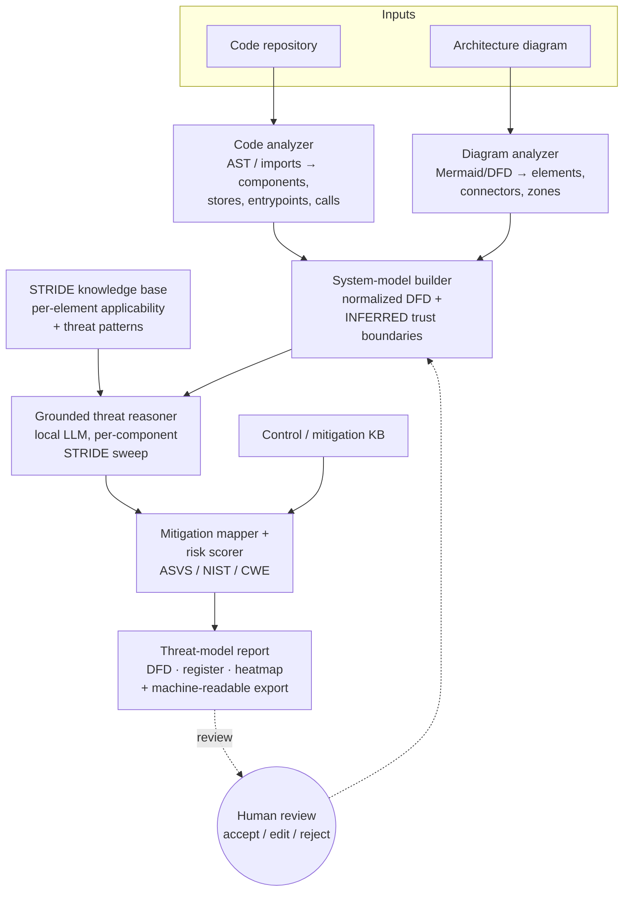
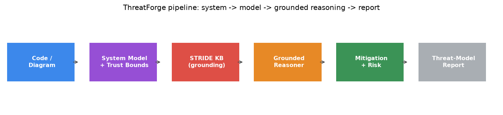
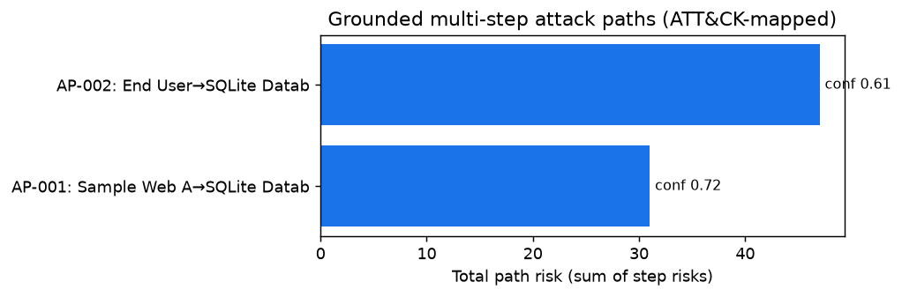
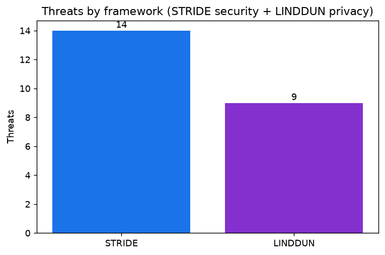
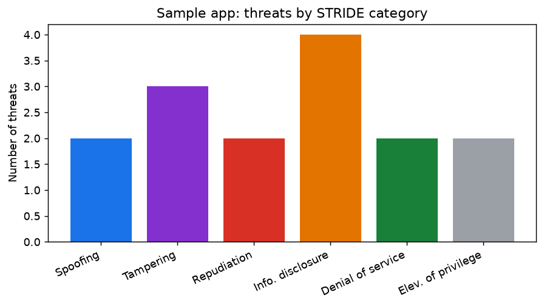
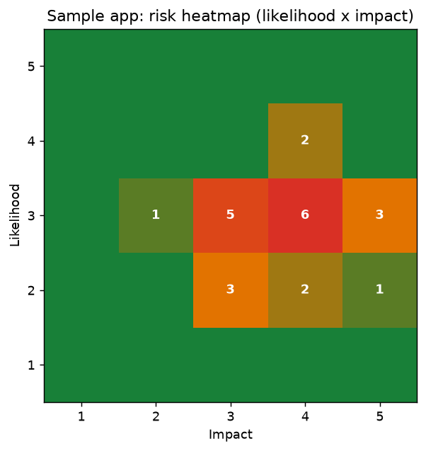
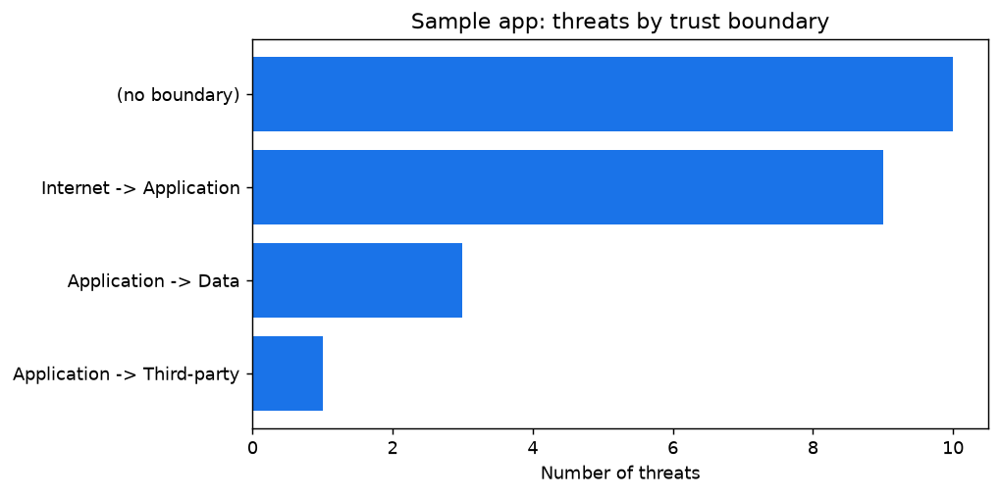
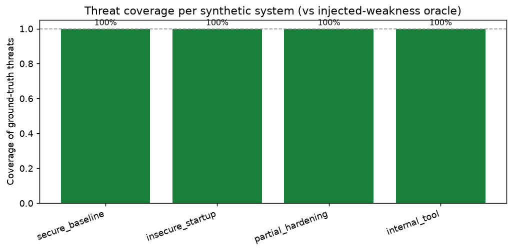
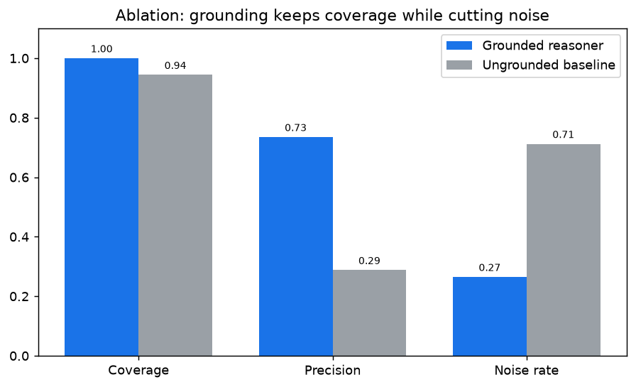

# ThreatForge

[](https://github.com/Krishita17/threat-forge/actions/workflows/ci.yml)
[](https://github.com/Krishita17/threat-forge/actions/workflows/threat-model.yml)

[](LICENSE)


**An automated STRIDE threat-model generator from code and architecture diagrams.**

*Read your repo or architecture diagram and draft a reviewed STRIDE threat model —
trust boundaries, data-flow diagram, per-component threats, and mapped
mitigations — turning the most-skipped security practice into a ten-minute
starting point instead of a blank page.*

Author: **Krishita Sanjay Choksi** · License: MIT · © 2026 Krishita Sanjay Choksi

> **Draft for review, not a security sign-off.** ThreatForge drafts a threat model
> for a human expert to accept, edit, or reject. It can miss real threats and
> propose spurious ones. It accelerates the expert; it does not replace them. See
> [`docs/scope_and_ethics.md`](docs/scope_and_ethics.md).

---

## Why this exists

Threat modeling is one of the highest-leverage activities in security — done
early, it catches design-level flaws no scanner ever will. Yet most teams skip it,
because it is manual, slow, and demands a scarce skill: someone who can look at a
system and reason about how it breaks. The barrier is rarely that teams don't
value threat models — it's the **cost of starting one from a blank page**.

The open-tooling landscape reflects this. A few excellent tools
([OWASP Threat Dragon](https://owasp.org/www-project-threat-dragon/),
[pytm](https://github.com/OWASP/pytm)) let a human *draw* a model or write it as
code — but almost nothing *drafts the model for you* from the system you already
have.

**ThreatForge is that drafting engine.**

## Novelty: it drafts, it doesn't just draw

Static analysis, LLM reasoning, the STRIDE framework, and threat-model editors all
exist separately. ThreatForge's contribution is the way they are combined:

1. **System-model recovery** — it extracts a data-flow diagram *with inferred
   trust boundaries* from real code and/or a diagram, instead of requiring a human
   to draw it. This is the grounding contribution and the hardest part.
2. **Grounded STRIDE reasoning** — it constrains the LLM to the extracted model
   plus a STRIDE applicability knowledge base, so it proposes relevant,
   non-hallucinated, per-component threats rather than generic boilerplate.
3. **Threat → control mapping + triage** — each threat rolls up to a concrete
   mitigation, a named control (OWASP ASVS / NIST 800-53 / CWE), and a
   likelihood × impact risk score, so the register is triaged, not a flat list.
4. **Human-in-the-loop draft + interchange** — every stage emits a reviewable
   artifact, and the result exports to pytm and Threat Dragon so the draft flows
   into existing tooling instead of forking the practice.

The guiding split: **structure from static analysis, reasoning grounded on that
structure, judgment from the human.**

## Architecture





## A worked example (bundled, reproducible)

Running the full pipeline on the bundled sample app
([`samples/py_webapp`](samples/py_webapp)) — a small Flask service with a SQLite
store and a third-party payment call — fusing its **code** and a hand-drawn
**diagram**:

```bash
make sample
```

### Recovered data-flow diagram with trust boundaries

The tool recovered 4 components, 3 data flows, and **inferred 3 trust boundaries**
(Internet → Application, Application → Data, Application → Third-party). Red
dashed lines are the inferred boundaries; red arrows are unencrypted
boundary-crossing flows:


### Threat register (signature artifact — auto-generated)

| ID | Component | STRIDE | Threat | Boundary | Risk |
| --- | --- | --- | --- | --- | --- |
| TF-008 | End User | Spoofing | Unauthenticated external actor can impersonate a legitimate user | - | 16 (High) |
| TF-001 | Sample Web App Service | Spoofing | Process accepts requests without verifying caller identity | Internet → Application | 16 (High) |
| TF-011 | SQLite Database | Information disclosure | Sensitive data at rest is not encrypted | - | 15 (High) |
| TF-014 | SQLite Database | Information disclosure | Sensitive data is exposed in transit | Application → Data | 15 (High) |
| TF-006 | Sample Web App Service | Elevation of privilege | Missing or weak authorization enables privilege escalation | Internet → Application | 15 (High) |
| TF-013 | SQLite Database | Tampering | Data in transit can be tampered with across a trust boundary | Application → Data | 12 (High) |
| TF-002 | Sample Web App Service | Tampering | Untrusted input reaches the process without validation | Internet → Application | 12 (High) |
| TF-007 | Sample Web App Service | Elevation of privilege | Internet-facing path can reach privileged/admin functionality | Internet → Application | 10 (Medium) |
| TF-005 | Sample Web App Service | Denial of service | No rate limiting on an internet-facing process | Internet → Application | 9 (Medium) |
| TF-003 | Sample Web App Service | Repudiation | Security-relevant actions are not auditable | Internet → Application | 9 (Medium) |
| ... | | | _(full register in [`reports/sample_webapp_threat_model.md`](reports/sample_webapp_threat_model.md))_ | | |

### Mitigation / remediation table (threat → control → OWASP Top 10 → fix → priority)

| ID | Threat | Mapped controls | CWE | OWASP Top 10 | Priority |
| --- | --- | --- | --- | --- | --- |
| TF-008 | Impersonation of a legitimate user | ASVS-2.1.1, NIST-IA-2, NIST-IA-5 | CWE-287 | A07:2021 | High |
| TF-011 | Sensitive data at rest not encrypted | ASVS-8.3.4, NIST-SC-28 | CWE-311 | A02:2021 | High |
| TF-006 | Weak authorization → privilege escalation | ASVS-4.1.1, ASVS-4.1.3, NIST-AC-3, NIST-AC-6 | CWE-285 | A01:2021 | High |
| TF-002 | Untrusted input without validation | ASVS-5.1.3, ASVS-5.3.4 | CWE-20 | A03:2021 | High |
| TF-005 | No rate limiting (DoS) | ASVS-11.1.4, NIST-SC-5 | CWE-770 | A04:2021 | Medium |

_Full recommended fixes are in the generated report; requirement text is
paraphrased from the frameworks (genuine control IDs/titles)._

## Drop it into your workflow

ThreatForge is built to live in CI, not just on a laptop. Everything below is
part of the tool — no extra services.

### 1. GitHub Action — threats in the Security tab, on every PR

```yaml
# .github/workflows/threat-model.yml
permissions: { contents: read, security-events: write }
jobs:
  threat-model:
    runs-on: ubuntu-latest
    steps:
      - uses: actions/checkout@v4
      - id: tf
        uses: Krishita17/threat-forge@main        # ← the Action
        with:
          code: .
          diagram: docs/architecture.mmd           # optional
          gate: "true"                              # fail PRs on NEW high-risk threats
      - uses: github/codeql-action/upload-sarif@v3  # ← threats appear as code-scanning alerts
        with: { sarif_file: "${{ steps.tf.outputs.sarif }}" }
```

The Action drafts the model, writes the threat register to the **job summary**,
uploads **SARIF** so each threat shows up as a GitHub **code-scanning alert**
(with CWE, OWASP Top 10 and the mapped control), and can optionally **gate** the
PR. This repo [runs it on itself](.github/workflows/threat-model.yml).

### 2. Baseline + gate — adopt without being blocked by the backlog

Like a linter's accepted-warnings file: accept what exists today, then fail CI
only on **new** risk.

```bash
make baseline      # writes .threatforge.baseline.json (accepted threats)
make gate          # exits 1 if a new threat >= High appears; prints a PR-ready table
```

### 3. Threat diff — "what did this change introduce?"

```bash
python -m src.cli diff --code . --old prev.threatforge.json
# → N new threats, M resolved, K risk-changed — as a Markdown table for the PR
```

### 4. Interactive HTML report — triage in the browser

`make report` also emits a **single self-contained HTML file** (no server, no
assets): filter by STRIDE/risk, search, sort, expand each threat's rationale and
fix, and flip its **accept / edit / reject** status — the human-in-the-loop step,
made usable. See `reports/sample_webapp_threat_model.html`.

### 5. Exports for the tools you already use

Every run emits machine-readable models so the draft flows onward:
**SARIF** (GitHub), **pytm** (threats-as-code), **OWASP Threat Dragon** (GUI),
a **GitHub-native Mermaid DFD**, native **JSON**, and a **shields.io badge**.

### 6. Python *and* JavaScript/TypeScript — and infrastructure-as-code

The code analyzer auto-detects the language. Python uses AST analysis; JS/TS uses
`package.json` + source heuristics (Express/Fastify/Nest, pg/mongoose/redis/prisma,
axios/got, passport/jwt, zod/joi, rate limiters, loggers). An **IaC analyzer**
(`--iac`) models **Terraform** and **Kubernetes** — public buckets, security
groups open to `0.0.0.0/0`, publicly-accessible databases, `LoadBalancer`
services, ingress edges, secrets — so cloud teams get a model too. Same DFD, same
pipeline across every input.

## What makes it different

These are the features no other open threat-modeling tool ships — built with the
same grounding + human-review discipline as the core, so they inform judgment
rather than replace it.

### Attack-path chaining with MITRE ATT&CK

Every other tool emits a flat per-component list. ThreatForge chains threats along
the **real data-flow graph** into multi-step attack paths and maps each step to a
MITRE ATT&CK technique. Grounded: every hop must carry a real threat from the
register, paths are ranked by severity, and low-confidence paths are flagged — an
attack graph full of implausible paths loses trust faster than none.



```
AP-002: End User → SQLite Database   (risk 47, confidence 0.61)
  1. End User                Spoofing   T1110 Brute Force          [Credential Access]
  2. Sample Web App Service  Spoofing   T1078 Valid Accounts       [Initial Access]
  3. SQLite Database         Info. disc. T1213 Data from Repos.    [Collection]
```

```bash
make attack     # or: python -m src.cli attack --code . 
```

### Threat → auto-generated verification (pytest + Sigma)

Closes the loop: for each threat ThreatForge emits a **pytest** stub that encodes
the mitigation as an assertion, and a **Sigma** detection-rule skeleton for the
attack. Tests start `@pytest.mark.skip` until a human wires them to the system —
a generated test that silently passes is worse than none.

```bash
make verify     # writes reports/test_*_security.py and reports/*.sigma.yml
```

### LINDDUN privacy threats, alongside STRIDE

A second framework for the GDPR/privacy crowd: run the **LINDDUN** privacy sweep
(Linkability, Identifiability, Disclosure, Unawareness, Non-compliance…) with the
same grounded reasoner. Privacy threats map to GDPR articles and NIST privacy
controls.



```bash
make privacy    # STRIDE security + LINDDUN privacy in one register
```

### Trust you can audit: traceability, confidence, and review flags

- **Traceability** — each threat records the `file:line` (or model element) that
  grounded it, so a reviewer can verify the evidence instantly.
- **Calibrated confidence** — every threat carries a confidence; heuristic
  patterns that assume an absent control score lower.
- **Needs-review flag** — high-risk *or* low-confidence threats are explicitly
  flagged for mandatory human review.

### Compliance crosswalk (SOC 2 / ISO 27001 / PCI DSS)

Every mapped control is also crosswalked to **SOC 2** Trust Services Criteria,
**ISO/IEC 27001:2022** Annex A, and **PCI DSS v4.0** — so the same register serves
the GRC audience, not just engineers.

## Results

All numbers below are produced by `make all` and written to
[`results/`](results/); the charts are regenerated by `make figures`.

### Charts

| | |
| --- | --- |
|  |  |
|  |  |

### Headline: grounding ablation

The strongest result. The **grounded** reasoner (constrained to the extracted
model + STRIDE KB) is compared against an **ungrounded** baseline that emits
textbook STRIDE threats per element type — mimicking "just ask the LLM."



| Reasoner | Coverage | Precision | Noise rate | Threats proposed |
| --- | :-: | :-: | :-: | :-: |
| **Grounded** | **1.00** | **0.74** | **0.27** | 49 |
| Ungrounded baseline | 0.94 | 0.29 | 0.71 | 118 |

**Grounding keeps coverage while cutting the noise rate by 0.45 and more than
doubling precision** — quantifying how much the structure-extraction layer
matters. (Deterministic, seed 7.)

### Coverage, precision, and the honest noise rate

| Evaluation | Coverage | Precision | Noise rate |
| --- | :-: | :-: | :-: |
| Synthetic catalog (vs injected-weakness oracle, 4 systems) | 1.00 | 0.74 | 0.27 |
| Sample app (vs hand-authored expert reference) | 1.00 | 1.00 | 0.00 |

The synthetic noise rate is reported **honestly**: on already-hardened systems the
tool surfaces low-value candidates a reviewer then prunes, which is exactly why
human review is mandatory. Matching is at the `(component, STRIDE-category)`
granularity. See [`docs/scope_and_ethics.md`](docs/scope_and_ethics.md) for the
full false-positive / false-negative discussion.

## STRIDE-per-element applicability (the KB, made visible)

The reasoner is grounded on this canonical mapping (see
[`frameworks/README.md`](frameworks/README.md) and
[`src/stride/stride_kb.yaml`](src/stride/stride_kb.yaml)):

| DFD element | S | T | R | I | D | E |
| --- | :-: | :-: | :-: | :-: | :-: | :-: |
| External entity | ✓ | | ✓ | | | |
| Process | ✓ | ✓ | ✓ | ✓ | ✓ | ✓ |
| Data store | | ✓ | ✓ | ✓ | ✓ | |
| Data flow | | ✓ | | ✓ | ✓ | |

## Install

Prerequisites: Python 3.10+ and `make`.

```bash
git clone https://github.com/Krishita17/threat-forge.git
cd threat-forge
make setup          # creates .venv and installs requirements
```

Or manually:

```bash
python3 -m venv .venv
source .venv/bin/activate
pip install -r requirements.txt
```

The default reasoner backend is a **deterministic offline stub** (no model
download, no network, no GPU), so everything runs from a clean clone. To use a
real local LLM, set `reasoner.backend` to `local-llm` in
[`config/config.json`](config/config.json) and point `base_url`/`model` at a local
OpenAI-compatible endpoint (e.g. Ollama) — sensitive architecture never leaves
your machine, and it falls back to the stub if the endpoint is unreachable.

## Usage

Each stage is a Makefile target (and a CLI subcommand) so you can review between
stages:

```bash
make data            # generate synthetic systems + matching diagrams + ground truth
make model           # summarize the recovered model + inferred trust boundaries
make reason          # run the grounded per-component STRIDE sweep
make attack          # chain threats into MITRE ATT&CK-mapped attack paths
make verify          # generate security tests (pytest) + Sigma detection rules
make privacy         # STRIDE security + LINDDUN privacy sweep
make report          # full threat-model report + exports (sample app)
make evaluate        # coverage / precision / noise on the synthetic catalog
make reference-eval  # Tier-2: tool output vs a hand-authored expert reference
make ablation        # grounded vs ungrounded reasoner (headline result)
make baseline        # record current threats as the accepted baseline
make gate            # fail (exit 1) on new threats above the baseline (CI gating)
make figures         # regenerate every chart in figures/
make test            # run the test suite
make all             # the whole pipeline end-to-end
```

Run on your own inputs (code, a diagram, or both):

```bash
./.venv/bin/python -m src.cli report --name "My Service" \
    --code path/to/repo --diagram path/to/diagram.mmd --out reports/
```

Any one input works; combine them and they corroborate. Outputs land in
`reports/`: a Markdown threat model, an interactive HTML report, the DFD (SVG +
Mermaid), attack-path graph JSON, generated pytest + Sigma rules, and
machine-readable exports (`*.threatforge.json`, SARIF, a pytm script, a Threat
Dragon-importable model, and a shields.io badge).

## How it works

| Stage | Module | What it does |
| --- | --- | --- |
| Code analyzer | [`src/analyze_code`](src/analyze_code) | Static AST/import analysis → processes, data stores, external entities, entrypoints (Python + JS/TS). |
| Diagram analyzer | [`src/analyze_diagram`](src/analyze_diagram) | Parses Mermaid/DFD into the same element/connector vocabulary. |
| IaC analyzer | [`src/analyze_iac`](src/analyze_iac) | Terraform + Kubernetes → cloud components, exposure, trust zones. |
| System-model builder | [`src/model`](src/model) | Fuses inputs into one normalized DFD and **infers trust boundaries**. |
| STRIDE KB | [`src/stride`](src/stride) | Per-element applicability + matchable threat patterns, as editable YAML. |
| Grounded reasoner | [`src/reason`](src/reason) | Per-component STRIDE sweep constrained to the model + KB; pluggable backend. |
| Mitigation mapper | [`src/mitigate`](src/mitigate) | Threat → mitigation → control + OWASP Top 10 + compliance + ATT&CK + risk. |
| Attack grapher | [`src/attack`](src/attack) | Chains threats into ATT&CK-mapped multi-step attack paths. |
| Verification | [`src/verify`](src/verify) | Generates pytest security tests + Sigma detection rules per threat. |
| Report generator | [`src/report`](src/report) | DFD, register, heatmap, HTML, SARIF, exports, diff/baseline/gate. |

## Data

- **Synthetic** — an architecture generator produces systems with tunable knobs
  (trust boundaries, authn/crypto, data sensitivity, exposure), each shipping a
  **ground-truth expected threat set** derived independently from the injected
  weaknesses (not from the KB evaluator), plus a matching Mermaid diagram.
- **Real** — the bundled permissively-licensed sample app, a hand-authored gold
  reference threat model in [`references/`](references), and the real frameworks
  (STRIDE, ASVS, NIST families, CWE) as reference data with genuine IDs/titles and
  paraphrased requirement text.

## Reproducibility

Deterministic given the seed (default `7`) and the stub backend. `make all`
regenerates everything in `results/` and `figures/`. See
[`experiments/`](experiments) for configs and
[`config/config.json`](config/config.json) for the backend/seed toggles.

## Limitations

ThreatForge **reduces the cost of starting** a threat model; it does not guarantee
completeness.

- **False negatives** — structure it cannot recover (undocumented components,
  dynamic wiring, business-logic flaws) won't be modelled, and the KB is finite.
- **False positives** — the analyzer is conservative (assumes a control is absent
  unless it sees evidence), which surfaces candidates for a human to prune; noise
  is higher on hardened systems.

A generated threat model informs human security decisions and **does not replace
professional security review**.

## Repository layout

```
threat-forge/
├── src/
│   ├── analyze_code/   analyze_diagram/   model/   stride/
│   ├── reason/         mitigate/          report/  data/
│   ├── experiments/    cli.py  pipeline.py  config.py
├── frameworks/   references/   experiments/
├── samples/      results/      figures/     reports/
├── tests/        docs/         config/      .github/workflows/
```

## License & citation

MIT License, © 2026 Krishita Sanjay Choksi. If you use ThreatForge, please cite it
via [`CITATION.cff`](CITATION.cff).
