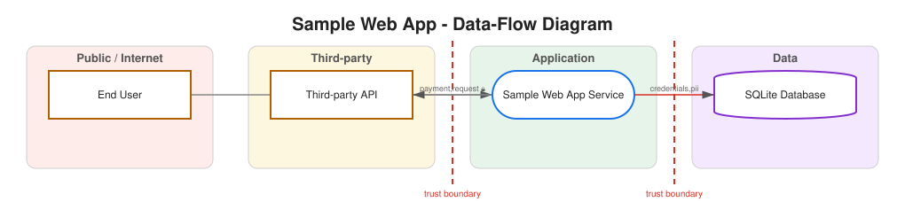

# Threat Model: Sample Web App

> **Draft for review - not a security sign-off.** ThreatForge produces a candidate STRIDE threat model from recovered structure. It can miss real threats and propose spurious ones. A competent human must review, edit, accept or reject every item below. Author: Krishita Sanjay Choksi.

## Summary

| Metric | Value |
| --- | --- |
| Components | 4 |
| Data flows | 3 |
| Trust boundaries | 3 |
| Threats identified | 23 |
| Critical / High | 11 |

## Data-Flow Diagram

## Trust Boundaries (inferred)

| Boundary | Crossing flows |
| --- | --- |
| Internet -> Application | 1 |
| Application -> Third-party | 1 |
| Application -> Data | 1 |

## Threats by STRIDE Category

| Category | Count |
| --- | --- |
| Spoofing | 2 |
| Tampering | 3 |
| Repudiation | 2 |
| Information disclosure | 4 |
| Denial of service | 2 |
| Elevation of privilege | 2 |

## Threat Register

| ID | Component | Category | Threat | Boundary | Risk | Conf. | Review? |
| --- | --- | --- | --- | --- | --- | --- | --- |
| TF-008 | End User | Spoofing | Unauthenticated external actor can impersonate a legitimate user | - | 16 (High) | 0.85 | yes |
| TF-001 | Sample Web App Service | Spoofing | Process accepts requests without verifying caller identity | Internet -> Application | 16 (High) | 0.85 | yes |
| TF-011 | SQLite Database | Information disclosure | Sensitive data at rest is not encrypted | - | 15 (High) | 0.85 | yes |
| TF-014 | SQLite Database | Information disclosure | Sensitive data is exposed in transit | Application -> Data | 15 (High) | 0.85 | yes |
| TF-006 | Sample Web App Service | Elevation of privilege | Missing or weak authorization enables privilege escalation | Internet -> Application | 15 (High) | 0.85 | yes |
| PRIV-008 | SQLite Database | Disclosure of information | Personal data is disclosed across a boundary | Application -> Data | 12 (High) | 0.70 | yes |
| PRIV-004 | SQLite Database | Identifiability | Individuals are identifiable (no data minimisation/anonymisation) | - | 12 (High) | 0.60 | yes |
| TF-013 | SQLite Database | Tampering | Data in transit can be tampered with across a trust boundary | Application -> Data | 12 (High) | 0.85 | yes |
| PRIV-007 | Sample Web App Service | Disclosure of information | Personal data is disclosed across a boundary | Internet -> Application | 12 (High) | 0.70 | yes |
| TF-002 | Sample Web App Service | Tampering | Untrusted input reaches the process without validation | Internet -> Application | 12 (High) | 0.85 | yes |
| PRIV-009 | Third-party API | Disclosure of information | Personal data is disclosed across a boundary | Application -> Third-party | 12 (High) | 0.70 | yes |
| TF-007 | Sample Web App Service | Elevation of privilege | Internet-facing path can reach privileged/admin functionality | Internet -> Application | 10 (Medium) | 0.85 | no |
| PRIV-002 | End User | Unawareness | Data subject may be unaware of processing (no consent signal) | - | 9 (Medium) | 0.50 | yes |
| PRIV-003 | SQLite Database | Linkability | Records are linkable across contexts (no pseudonymisation) | - | 9 (Medium) | 0.60 | yes |
| TF-005 | Sample Web App Service | Denial of service | No rate limiting on an internet-facing process | Internet -> Application | 9 (Medium) | 0.85 | no |
| TF-003 | Sample Web App Service | Repudiation | Security-relevant actions are not auditable | Internet -> Application | 9 (Medium) | 0.85 | no |
| PRIV-006 | Third-party API | Unawareness | Data subject may be unaware of processing (no consent signal) | - | 9 (Medium) | 0.50 | yes |
| PRIV-005 | SQLite Database | Non-compliance | No retention/governance controls on personal data (non-compliance) | - | 8 (Medium) | 0.55 | yes |
| TF-009 | SQLite Database | Tampering | Stored data can be modified without detection | - | 8 (Medium) | 0.85 | no |
| TF-012 | SQLite Database | Denial of service | Unbounded growth or connection exhaustion in the store | - | 6 (Medium) | 0.55 | yes |
| TF-010 | SQLite Database | Repudiation | Writes to the store are not attributable | - | 6 (Medium) | 0.85 | no |
| PRIV-001 | Sample Web App Service | Disclosure of information | Process may over-collect or over-expose personal data | Internet -> Application | 6 (Medium) | 0.55 | yes |
| TF-004 | Sample Web App Service | Information disclosure | Verbose errors or responses leak internal detail | Internet -> Application | 6 (Medium) | 0.50 | yes |

_`Conf.` is calibrated confidence; `Review? = yes` flags threats a human must confirm (high-risk or low-confidence)._

## Attack Paths (chained, with MITRE ATT&CK)

Multi-step paths an attacker could follow along the data-flow graph, each step mapped to a MITRE ATT&CK technique. Grounded: every hop carries a real threat from the register.

### AP-002: End User → SQLite Database (risk 47, confidence 0.61)

| # | Component | STRIDE | Threat | ATT&CK technique | Tactic |
| --- | --- | --- | --- | --- | --- |
| 1 | End User | Spoofing | Unauthenticated external actor can impersonate a legitimate user | T1110 Brute Force | Credential Access |
| 2 | Sample Web App Service | Spoofing | Process accepts requests without verifying caller identity | T1078 Valid Accounts | Initial Access |
| 3 | SQLite Database | Information disclosure | Sensitive data at rest is not encrypted | T1213 Data from Information Repositories | Collection |

### AP-001: Sample Web App Service → SQLite Database (risk 31, confidence 0.72)

| # | Component | STRIDE | Threat | ATT&CK technique | Tactic |
| --- | --- | --- | --- | --- | --- |
| 1 | Sample Web App Service | Spoofing | Process accepts requests without verifying caller identity | T1078 Valid Accounts | Initial Access |
| 2 | SQLite Database | Information disclosure | Sensitive data at rest is not encrypted | T1213 Data from Information Repositories | Collection |

## Mitigations and Mapped Controls

| ID | Threat | Mapped controls | CWE | OWASP | Compliance (SOC2/ISO/PCI) | Recommended fix | Priority |
| --- | --- | --- | --- | --- | --- | --- | --- |
| TF-008 | Unauthenticated external actor can impersonate a legitimate user | ASVS-2.1.1 (Password security), NIST-IA-2 (Identification and Authentication (Organizational Users)), NIST-IA-5 (Authenticator Management) | CWE-287 | A07:2021 | SOC2:CC6.1, ISO27001:A.5.17, PCIDSS:8.3, ISO27001:A.5.16, PCIDSS:8.2 | Require strong authentication for this actor (MFA where feasible), enforce password/credential policy, and rate-limit/lock out credential-stuffing attempts. | High |
| TF-001 | Process accepts requests without verifying caller identity | ASVS-2.1.1 (Password security), NIST-IA-2 (Identification and Authentication (Organizational Users)) | CWE-306 | A07:2021 | SOC2:CC6.1, ISO27001:A.5.17, PCIDSS:8.3, ISO27001:A.5.16, PCIDSS:8.2 | Authenticate every request to this process; reject or challenge unauthenticated callers at the trust boundary. | High |
| TF-011 | Sensitive data at rest is not encrypted | ASVS-8.3.4 (Protect data at rest), NIST-SC-28 (Protection of Information at Rest) | CWE-311 | A02:2021 | SOC2:CC6.7, ISO27001:A.8.24, PCIDSS:3.5 | Encrypt sensitive data at rest, manage keys separately from data, and restrict decrypt access to least privilege. | High |
| TF-014 | Sensitive data is exposed in transit | ASVS-9.1.1 (Transport security), ASVS-8.3.1 (Sensitive data in requests), NIST-SC-8 (Transmission Confidentiality and Integrity) | CWE-319 | A02:2021 | SOC2:CC6.7, ISO27001:A.8.24, PCIDSS:4.2, PCIDSS:3.4 | Encrypt the channel end-to-end; minimize sensitive fields in transit and avoid placing them in URLs or logs. | High |
| TF-006 | Missing or weak authorization enables privilege escalation | ASVS-4.1.1 (General access control design), ASVS-4.1.3 (Least-privilege access control), NIST-AC-3 (Access Enforcement), NIST-AC-6 (Least Privilege) | CWE-285 | A01:2021 | SOC2:CC6.3, ISO27001:A.5.15, PCIDSS:7.2, ISO27001:A.8.2 | Enforce server-side, deny-by-default authorization on every privileged action; apply least privilege and verify object-level access. | High |
| PRIV-008 | Personal data is disclosed across a boundary | GDPR-ART5-MIN (Data Minimisation (Art. 5(1)(c))), NIST-PT-3 (Personally Identifiable Information Processing Purposes) | - | - | - | Share the minimum personal data necessary across the boundary; apply purpose limitation and a data-processing agreement for third parties. | High |
| PRIV-004 | Individuals are identifiable (no data minimisation/anonymisation) | GDPR-ART5-MIN (Data Minimisation (Art. 5(1)(c))), NIST-PT-3 (Personally Identifiable Information Processing Purposes) | - | - | - | Minimise collected fields, anonymise or aggregate where possible, and avoid storing direct identifiers you do not need. | High |
| TF-013 | Data in transit can be tampered with across a trust boundary | ASVS-9.1.1 (Transport security), NIST-SC-8 (Transmission Confidentiality and Integrity) | CWE-319 | A02:2021 | SOC2:CC6.7, ISO27001:A.8.24, PCIDSS:4.2 | Encrypt and integrity-protect the channel (TLS 1.2+); reject plaintext transport for any boundary-crossing flow. | High |
| PRIV-007 | Personal data is disclosed across a boundary | GDPR-ART5-MIN (Data Minimisation (Art. 5(1)(c))), NIST-PT-3 (Personally Identifiable Information Processing Purposes) | - | - | - | Share the minimum personal data necessary across the boundary; apply purpose limitation and a data-processing agreement for third parties. | High |
| TF-002 | Untrusted input reaches the process without validation | ASVS-5.1.3 (Input validation), ASVS-5.3.4 (Injection prevention) | CWE-20 | A03:2021 | SOC2:CC7.1, ISO27001:A.8.28, PCIDSS:6.2.4 | Validate and canonicalize all input at the boundary; use parameterized queries and context-aware output encoding. | High |
| PRIV-009 | Personal data is disclosed across a boundary | GDPR-ART5-MIN (Data Minimisation (Art. 5(1)(c))), NIST-PT-3 (Personally Identifiable Information Processing Purposes) | - | - | - | Share the minimum personal data necessary across the boundary; apply purpose limitation and a data-processing agreement for third parties. | High |
| TF-007 | Internet-facing path can reach privileged/admin functionality | ASVS-4.1.1 (General access control design), NIST-AC-6 (Least Privilege) | CWE-269 | A01:2021 | SOC2:CC6.3, ISO27001:A.5.15, PCIDSS:7.2, ISO27001:A.8.2 | Segment admin functionality behind separate authentication and network controls; never expose privileged operations on the public path. | Medium |
| PRIV-002 | Data subject may be unaware of processing (no consent signal) | GDPR-ART13 (Information to the Data Subject (Art. 13)) | - | - | - | Provide clear processing notices and capture a lawful basis/consent; expose data-subject rights (access, erasure). | Medium |
| PRIV-003 | Records are linkable across contexts (no pseudonymisation) | GDPR-ART25 (Data Protection by Design (Art. 25)), NIST-PT-3 (Personally Identifiable Information Processing Purposes) | - | - | - | Pseudonymise or tokenise identifiers at rest; separate linkable keys from personal data and restrict re-identification. | Medium |
| TF-005 | No rate limiting on an internet-facing process | ASVS-11.1.4 (Anti-automation / rate limiting), NIST-SC-5 (Denial-of-Service Protection) | CWE-770 | A04:2021 | SOC2:A1.1, ISO27001:A.8.6, PCIDSS:6.4.2 | Apply rate limiting, request quotas, timeouts and resource caps; place the service behind an edge/DoS-protection layer. | Medium |
| TF-003 | Security-relevant actions are not auditable | ASVS-7.1.3 (Security event logging), NIST-AU-2 (Event Logging), NIST-AU-9 (Protection of Audit Information) | CWE-778 | A09:2021 | SOC2:CC7.2, ISO27001:A.8.15, PCIDSS:10.2, PCIDSS:10.5 | Log security-relevant events with user identity, timestamp and outcome to an append-only, access-controlled store. | Medium |
| PRIV-006 | Data subject may be unaware of processing (no consent signal) | GDPR-ART13 (Information to the Data Subject (Art. 13)) | - | - | - | Provide clear processing notices and capture a lawful basis/consent; expose data-subject rights (access, erasure). | Medium |
| PRIV-005 | No retention/governance controls on personal data (non-compliance) | GDPR-ART5-STORAGE (Storage Limitation (Art. 5(1)(e))), NIST-SI-12 (Information Management and Retention) | - | - | - | Define and enforce retention/deletion schedules, log access to personal data, and document the lawful basis and purpose. | Medium |
| TF-009 | Stored data can be modified without detection | ASVS-1.9.2 (Data integrity in transit/storage), NIST-SI-7 (Software, Firmware, and Information Integrity) | CWE-345 | A08:2021 | SOC2:CC6.1, ISO27001:A.8.24, PCIDSS:4.2, SOC2:CC7.1, ISO27001:A.8.9, PCIDSS:11.5 | Apply write authorization, integrity checks (hashing/signing) and tamper-evident audit logging to the store. | Medium |
| TF-012 | Unbounded growth or connection exhaustion in the store | NIST-SC-5 (Denial-of-Service Protection) | CWE-770 | A04:2021 | SOC2:A1.1, ISO27001:A.8.6, PCIDSS:6.4.2 | Enforce connection pooling limits, quotas and input size caps upstream; monitor capacity and set alerts. | Medium |
| TF-010 | Writes to the store are not attributable | ASVS-7.1.3 (Security event logging), NIST-AU-2 (Event Logging) | CWE-778 | A09:2021 | SOC2:CC7.2, ISO27001:A.8.15, PCIDSS:10.2 | Record attributable, append-only change history for the store and protect it from the accounts that can write data. | Medium |
| PRIV-001 | Process may over-collect or over-expose personal data | GDPR-ART5-MIN (Data Minimisation (Art. 5(1)(c))), NIST-PT-3 (Personally Identifiable Information Processing Purposes) | - | - | - | Apply purpose limitation and least-privilege access to personal data; redact fields not required for the operation. | Medium |
| TF-004 | Verbose errors or responses leak internal detail | ASVS-7.4.1 (Safe error handling), ASVS-14.3.2 (Disable debug in production) | CWE-209 | A05:2021 | SOC2:CC7.2, ISO27001:A.8.28, PCIDSS:6.2.4, SOC2:CC7.1, ISO27001:A.8.9, PCIDSS:6.3 | Return generic error responses to clients; log detail server-side only; disable debug mode in production. | Medium |

## Threat Detail

### TF-008 - Unauthenticated external actor can impersonate a legitimate user

- **Component:** End User
- **STRIDE:** Spoofing
- **Rationale:** End User is an external entity whose requests are not strongly authenticated, so an attacker can impersonate it (e.g. credential stuffing, forged identity).
- **Mitigation:** Require strong authentication for this actor (MFA where feasible), enforce password/credential policy, and rate-limit/lock out credential-stuffing attempts.
- **Controls:** ASVS-2.1.1, NIST-IA-2, NIST-IA-5 | **CWE:** CWE-287
- **Risk:** likelihood 4 x impact 4 = 16 (High)
- **Source:** KB pattern `S-EXT-AUTHN`

### TF-001 - Process accepts requests without verifying caller identity

- **Component:** Sample Web App Service
- **STRIDE:** Spoofing
- **Trust boundary:** Internet -> Application
- **Rationale:** Sample Web App Service handles requests but does not authenticate its caller, allowing a spoofed client to act as a trusted one.
- **Mitigation:** Authenticate every request to this process; reject or challenge unauthenticated callers at the trust boundary.
- **Controls:** ASVS-2.1.1, NIST-IA-2 | **CWE:** CWE-306
- **Risk:** likelihood 4 x impact 4 = 16 (High)
- **Source:** KB pattern `S-PROC-WEAKAUTH`

### TF-011 - Sensitive data at rest is not encrypted

- **Component:** SQLite Database
- **STRIDE:** Information disclosure
- **Rationale:** SQLite Database stores sensitive data (credentials, pii) without encryption at rest, exposing it if the store is compromised.
- **Mitigation:** Encrypt sensitive data at rest, manage keys separately from data, and restrict decrypt access to least privilege.
- **Controls:** ASVS-8.3.4, NIST-SC-28 | **CWE:** CWE-311
- **Risk:** likelihood 3 x impact 5 = 15 (High)
- **Source:** KB pattern `I-STORE-ATREST`

### TF-014 - Sensitive data is exposed in transit

- **Component:** SQLite Database
- **STRIDE:** Information disclosure
- **Trust boundary:** Application -> Data
- **Rationale:** SQLite Database carries sensitive data (credentials, pii) across a boundary without encryption, so it can be intercepted.
- **Mitigation:** Encrypt the channel end-to-end; minimize sensitive fields in transit and avoid placing them in URLs or logs.
- **Controls:** ASVS-9.1.1, ASVS-8.3.1, NIST-SC-8 | **CWE:** CWE-319
- **Risk:** likelihood 3 x impact 5 = 15 (High)
- **Source:** KB pattern `I-FLOW-PLAINTEXT`

### TF-006 - Missing or weak authorization enables privilege escalation

- **Component:** Sample Web App Service
- **STRIDE:** Elevation of privilege
- **Trust boundary:** Internet -> Application
- **Rationale:** Sample Web App Service does not enforce authorization checks per action, so an authenticated low-privilege actor may perform privileged operations.
- **Mitigation:** Enforce server-side, deny-by-default authorization on every privileged action; apply least privilege and verify object-level access.
- **Controls:** ASVS-4.1.1, ASVS-4.1.3, NIST-AC-3, NIST-AC-6 | **CWE:** CWE-285
- **Risk:** likelihood 3 x impact 5 = 15 (High)
- **Source:** KB pattern `E-PROC-AUTHZ`

### PRIV-008 - Personal data is disclosed across a boundary

- **Component:** SQLite Database
- **STRIDE:** DD
- **Trust boundary:** Application -> Data
- **Rationale:** SQLite Database carries personal data (credentials, pii) across a trust boundary, exposing it to parties that may not need it.
- **Mitigation:** Share the minimum personal data necessary across the boundary; apply purpose limitation and a data-processing agreement for third parties.
- **Controls:** GDPR-ART5-MIN, NIST-PT-3 | **CWE:** -
- **Risk:** likelihood 3 x impact 4 = 12 (High)
- **Source:** KB pattern `DD-FLOW-DISCLOSE`

### PRIV-004 - Individuals are identifiable (no data minimisation/anonymisation)

- **Component:** SQLite Database
- **STRIDE:** Information disclosure
- **Rationale:** SQLite Database retains directly identifying personal data without minimisation or anonymisation, increasing re-identification risk.
- **Mitigation:** Minimise collected fields, anonymise or aggregate where possible, and avoid storing direct identifiers you do not need.
- **Controls:** GDPR-ART5-MIN, NIST-PT-3 | **CWE:** -
- **Risk:** likelihood 3 x impact 4 = 12 (High)
- **Source:** KB pattern `I-STORE-IDENT`

### TF-013 - Data in transit can be tampered with across a trust boundary

- **Component:** SQLite Database
- **STRIDE:** Tampering
- **Trust boundary:** Application -> Data
- **Rationale:** SQLite Database crosses a trust boundary without transport integrity (no TLS/encryption), so an on-path attacker can modify the data.
- **Mitigation:** Encrypt and integrity-protect the channel (TLS 1.2+); reject plaintext transport for any boundary-crossing flow.
- **Controls:** ASVS-9.1.1, NIST-SC-8 | **CWE:** CWE-319
- **Risk:** likelihood 3 x impact 4 = 12 (High)
- **Source:** KB pattern `T-FLOW-NOTLS`

### PRIV-007 - Personal data is disclosed across a boundary

- **Component:** Sample Web App Service
- **STRIDE:** DD
- **Trust boundary:** Internet -> Application
- **Rationale:** Sample Web App Service carries personal data (credentials, pii) across a trust boundary, exposing it to parties that may not need it.
- **Mitigation:** Share the minimum personal data necessary across the boundary; apply purpose limitation and a data-processing agreement for third parties.
- **Controls:** GDPR-ART5-MIN, NIST-PT-3 | **CWE:** -
- **Risk:** likelihood 3 x impact 4 = 12 (High)
- **Source:** KB pattern `DD-FLOW-DISCLOSE`

### TF-002 - Untrusted input reaches the process without validation

- **Component:** Sample Web App Service
- **STRIDE:** Tampering
- **Trust boundary:** Internet -> Application
- **Rationale:** Sample Web App Service receives data from a less-trusted zone and may process it without validation, enabling injection or state corruption.
- **Mitigation:** Validate and canonicalize all input at the boundary; use parameterized queries and context-aware output encoding.
- **Controls:** ASVS-5.1.3, ASVS-5.3.4 | **CWE:** CWE-20
- **Risk:** likelihood 3 x impact 4 = 12 (High)
- **Source:** KB pattern `T-PROC-INPUT`

### PRIV-009 - Personal data is disclosed across a boundary

- **Component:** Third-party API
- **STRIDE:** DD
- **Trust boundary:** Application -> Third-party
- **Rationale:** Third-party API carries personal data (payment, request) across a trust boundary, exposing it to parties that may not need it.
- **Mitigation:** Share the minimum personal data necessary across the boundary; apply purpose limitation and a data-processing agreement for third parties.
- **Controls:** GDPR-ART5-MIN, NIST-PT-3 | **CWE:** -
- **Risk:** likelihood 3 x impact 4 = 12 (High)
- **Source:** KB pattern `DD-FLOW-DISCLOSE`

### TF-007 - Internet-facing path can reach privileged/admin functionality

- **Component:** Sample Web App Service
- **STRIDE:** Elevation of privilege
- **Trust boundary:** Internet -> Application
- **Rationale:** Sample Web App Service is internet-facing and sits on a path toward trusted/admin functions; a flaw here can be leveraged to reach privileged operations.
- **Mitigation:** Segment admin functionality behind separate authentication and network controls; never expose privileged operations on the public path.
- **Controls:** ASVS-4.1.1, NIST-AC-6 | **CWE:** CWE-269
- **Risk:** likelihood 2 x impact 5 = 10 (Medium)
- **Source:** KB pattern `E-PROC-ADMIN`

### PRIV-002 - Data subject may be unaware of processing (no consent signal)

- **Component:** End User
- **STRIDE:** U
- **Rationale:** End User is a data subject whose awareness/consent for processing is not represented in the system.
- **Mitigation:** Provide clear processing notices and capture a lawful basis/consent; expose data-subject rights (access, erasure).
- **Controls:** GDPR-ART13 | **CWE:** -
- **Risk:** likelihood 3 x impact 3 = 9 (Medium)
- **Source:** KB pattern `U-EXT-CONSENT`

### PRIV-003 - Records are linkable across contexts (no pseudonymisation)

- **Component:** SQLite Database
- **STRIDE:** L
- **Rationale:** SQLite Database stores personal data without pseudonymisation, so records about the same person can be linked across contexts.
- **Mitigation:** Pseudonymise or tokenise identifiers at rest; separate linkable keys from personal data and restrict re-identification.
- **Controls:** GDPR-ART25, NIST-PT-3 | **CWE:** -
- **Risk:** likelihood 3 x impact 3 = 9 (Medium)
- **Source:** KB pattern `L-STORE-LINK`

### TF-005 - No rate limiting on an internet-facing process

- **Component:** Sample Web App Service
- **STRIDE:** Denial of service
- **Trust boundary:** Internet -> Application
- **Rationale:** Sample Web App Service is internet-facing without rate limiting or quotas, so it can be overwhelmed by request floods.
- **Mitigation:** Apply rate limiting, request quotas, timeouts and resource caps; place the service behind an edge/DoS-protection layer.
- **Controls:** ASVS-11.1.4, NIST-SC-5 | **CWE:** CWE-770
- **Risk:** likelihood 3 x impact 3 = 9 (Medium)
- **Source:** KB pattern `D-PROC-RATELIMIT`

### TF-003 - Security-relevant actions are not auditable

- **Component:** Sample Web App Service
- **STRIDE:** Repudiation
- **Trust boundary:** Internet -> Application
- **Rationale:** Sample Web App Service performs security-relevant actions but does not emit tamper-resistant audit logs, so actors can deny having acted.
- **Mitigation:** Log security-relevant events with user identity, timestamp and outcome to an append-only, access-controlled store.
- **Controls:** ASVS-7.1.3, NIST-AU-2, NIST-AU-9 | **CWE:** CWE-778
- **Risk:** likelihood 3 x impact 3 = 9 (Medium)
- **Source:** KB pattern `R-PROC-LOG`

### PRIV-006 - Data subject may be unaware of processing (no consent signal)

- **Component:** Third-party API
- **STRIDE:** U
- **Rationale:** Third-party API is a data subject whose awareness/consent for processing is not represented in the system.
- **Mitigation:** Provide clear processing notices and capture a lawful basis/consent; expose data-subject rights (access, erasure).
- **Controls:** GDPR-ART13 | **CWE:** -
- **Risk:** likelihood 3 x impact 3 = 9 (Medium)
- **Source:** KB pattern `U-EXT-CONSENT`

### PRIV-005 - No retention/governance controls on personal data (non-compliance)

- **Component:** SQLite Database
- **STRIDE:** NC
- **Rationale:** SQLite Database holds personal data without evidence of retention limits or access auditing, risking non-compliance with storage-limitation duties.
- **Mitigation:** Define and enforce retention/deletion schedules, log access to personal data, and document the lawful basis and purpose.
- **Controls:** GDPR-ART5-STORAGE, NIST-SI-12 | **CWE:** -
- **Risk:** likelihood 2 x impact 4 = 8 (Medium)
- **Source:** KB pattern `NC-STORE-RETAIN`

### TF-009 - Stored data can be modified without detection

- **Component:** SQLite Database
- **STRIDE:** Tampering
- **Rationale:** SQLite Database persists data without integrity controls or change auditing, so unauthorized modification may go unnoticed.
- **Mitigation:** Apply write authorization, integrity checks (hashing/signing) and tamper-evident audit logging to the store.
- **Controls:** ASVS-1.9.2, NIST-SI-7 | **CWE:** CWE-345
- **Risk:** likelihood 2 x impact 4 = 8 (Medium)
- **Source:** KB pattern `T-STORE-INTEGRITY`

### TF-012 - Unbounded growth or connection exhaustion in the store

- **Component:** SQLite Database
- **STRIDE:** Denial of service
- **Rationale:** SQLite Database can be driven to resource exhaustion (storage, connections) by unbounded writes from upstream processes.
- **Mitigation:** Enforce connection pooling limits, quotas and input size caps upstream; monitor capacity and set alerts.
- **Controls:** NIST-SC-5 | **CWE:** CWE-770
- **Risk:** likelihood 2 x impact 3 = 6 (Medium)
- **Source:** KB pattern `D-STORE-EXHAUST`

### TF-010 - Writes to the store are not attributable

- **Component:** SQLite Database
- **STRIDE:** Repudiation
- **Rationale:** SQLite Database does not record who changed what, so repudiation of data changes is possible.
- **Mitigation:** Record attributable, append-only change history for the store and protect it from the accounts that can write data.
- **Controls:** ASVS-7.1.3, NIST-AU-2 | **CWE:** CWE-778
- **Risk:** likelihood 2 x impact 3 = 6 (Medium)
- **Source:** KB pattern `R-STORE-LOG`

### PRIV-001 - Process may over-collect or over-expose personal data

- **Component:** Sample Web App Service
- **STRIDE:** DD
- **Trust boundary:** Internet -> Application
- **Rationale:** Sample Web App Service handles personal data; without purpose limitation it can collect or expose more than necessary.
- **Mitigation:** Apply purpose limitation and least-privilege access to personal data; redact fields not required for the operation.
- **Controls:** GDPR-ART5-MIN, NIST-PT-3 | **CWE:** -
- **Risk:** likelihood 2 x impact 3 = 6 (Medium)
- **Source:** KB pattern `DD-PROC-OVERCOLLECT`

### TF-004 - Verbose errors or responses leak internal detail

- **Component:** Sample Web App Service
- **STRIDE:** Information disclosure
- **Trust boundary:** Internet -> Application
- **Rationale:** Sample Web App Service is internet-facing and may return verbose errors/stack traces that disclose internal structure to attackers.
- **Mitigation:** Return generic error responses to clients; log detail server-side only; disable debug mode in production.
- **Controls:** ASVS-7.4.1, ASVS-14.3.2 | **CWE:** CWE-209
- **Risk:** likelihood 3 x impact 2 = 6 (Medium)
- **Source:** KB pattern `I-PROC-ERRORS`
